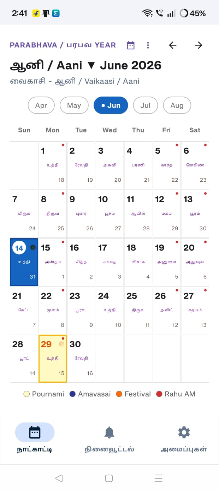
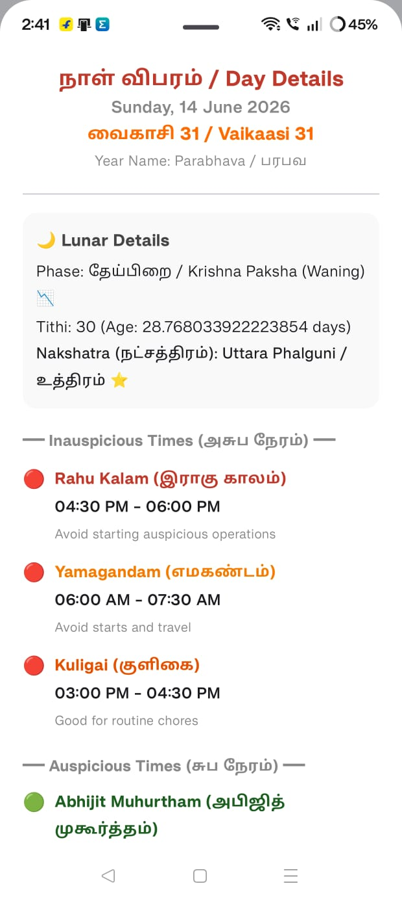
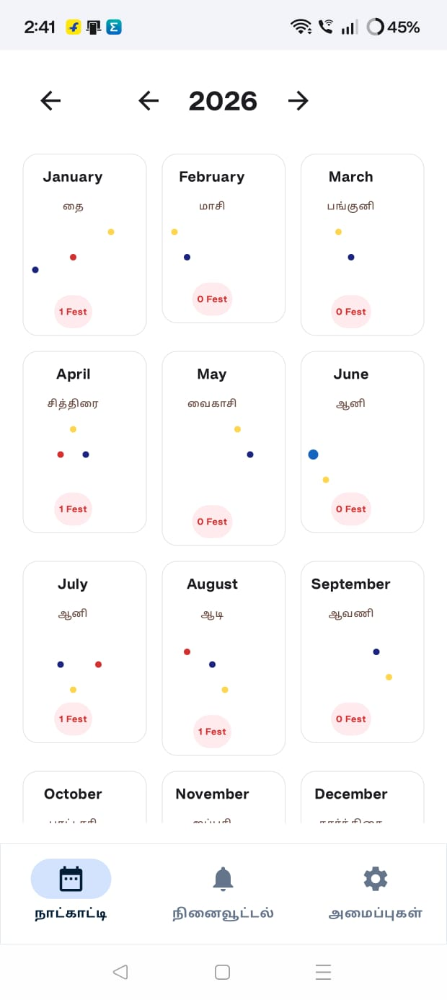
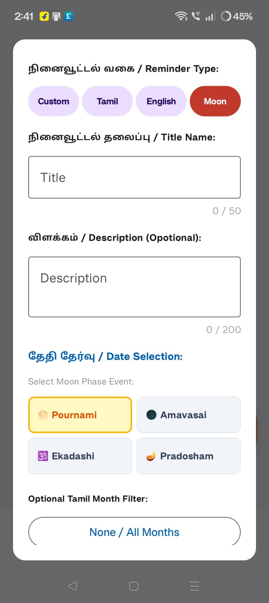
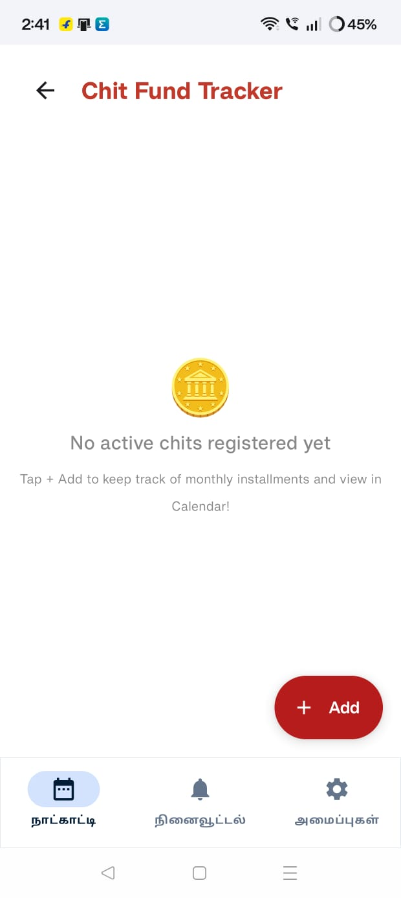

# 🗓️ தமிழ் நாட்காட்டி — Tamil Calendar App

<p align="center">
  
</p>

<p align="center">
  <b>A feature-rich offline Tamil Calendar 
  for Android</b><br/>
  Displays English & Tamil dates side by side 
  with smart reminders, Rahu Kalam, 
  Chit Fund tracker and more.
</p>

<p align="center">
  <a href="https://github.com/kumaresanramu/tamil-calendar-app/releases/download/V1.0.0/Tamil.Calendar.apk">
    
  </a>
</p>

---

## 📲 Download App

### 👉 [Click Here to Download APK](https://github.com/kumaresanramu/tamil-calendar-app/releases/download/V1.0.0/Tamil.Calendar.apk)

---

## 📱 Screenshots

<p align="center">
  
  &nbsp;&nbsp;
  
  &nbsp;&nbsp;
  
</p>

<p align="center">
  
  &nbsp;&nbsp;
  
</p>

---

## 🌟 Key Features

### 1. Traditional Almanac & Calendar (நாள்காட்டி)
*   **Dual Calendars:** Perfectly pairs the Gregorian Calendar with the Tamil Calendar (Chithirai/சித்திரை to Panguni/பங்குனி).
*   **Auspicious & Astronomical Timings:** Displays Nakshatra (நட்சத்திரம்), Tithi (திதி), Yoga, and Karana for any selected date.
*   **Panchangam Engine:** Computes Rahu Kalam (ராகு காலம்), Yamagandam (எமகண்டம்), and Gulika Kalam (குளிகை காலம்) dynamically based on local sunrise and sunset timings.
*   **Special Days & Festivals:** Fully highlights monthly auspicious events such as Pournami (Full Moon), Amavasai (New Moon), Ekadashi, and Pradosham.

### 2. Multi-Criteria Muhurtham Finder (முகூர்த்தம் தேடி)
*   Search and filter dynamic date ranges to discover highly auspicious marriage, housewarming, or business commencement hours (ஆத்த காலங்கள்) without requiring active internet connectivity.
*   Displays **Abhijit Muhurtham** (அபிஜித் முகூர்த்தம்) and rules out overlaps with adverse planetary hours.

### 3. Smart Local Reminders (நினைவூட்டல்கள்)
*   Schedule alerts for specific days or recurring holy intervals (e.g., automated alerts 1 day before every Pradosham or Ekadashi).
*   Powered by modern Android **AlarmManager** and local wake locks for highly accurate, battery-conscious local scheduling.

### 4. Chit Fund & Dividend Tracker (சீட்டு சேமிப்பு)
*   Keep your localized savings organized! Set monthly contribution plans, track monthly auction winners, calculate net dividend returns, and record your payout months.
*   Computes compound ROI and total contributions dynamically.

### 5. Family Birthday Planner (பிறந்தநாள் கேலெண்டர்)
*   Register dear ones with their Gregorian and computed astronomical Nakshatra.
*   Issues warm notifications on their birthdays automatically, keeping families close.

---

## 🛠️ Devops & Resiliency Features

This app is engineered with high production-grade stability and modern Android safety guardrails:

### Exception Protection & Diagnostics Report
*   **Crash Safeguard Matrix:** Configured with a default Uncaught Exception Handler that intercepts random OS runtime faults on a real device.
*   **System Notifications on Crash:** Instead of silently closing, the app instantly pops a high-priority system notification indicating it has safely recovered.
*   **Interactive Diagnostic Modal:** On relaunch, an interactive diagnostics report overlay allows the user to immediately review the exact stack trace and copy it onto their clipboard with a single tap for remote developer diagnostics.

### Android 12+ Background Stability & Permissions
*   **Exact Alarm Scheduling (`SCHEDULE_EXACT_ALARM`):** Requests system permission gracefully on launch to prevent modern Android restrictions (introduced in Android 12) from blocking background reminders.
*   **Instant Notification Prompts:** Prompts for Android 13+ `POST_NOTIFICATIONS` runtime authorization during onboarding so you never miss a holy moon phase event.

### Production Release Protections
*   **Large Heap Memory Allocation (`largeHeap="true"`):** Enables expanded RAM availability inside `AndroidManifest.xml` to prevent out-of-memory overhead during extensive panchangam date generations.
*   **Engineered Proguard/R8 Rules:** Custom obfuscation configurations directly preserve Room Database classes, JSON serialization adapters, desugared time reflection parameters, and helper models ensuring 100% stable production builds.

---

## 🏗️ Technical Architecture

*   **UI Layer:** 100% declarative UI built with **Jetpack Compose** and official **Material Design 3 (M3)** design tokens.
*   **Data Persistence:** local SQLite querying handled by **Room Database** with KSP-supported compile-time verification.
*   **Architecture Pattern:** Clean MVVM (Model-View-ViewModel) decoupling data flows from visual view states via thread-safe Kotlin Coroutines and asynchronous StateFlow stream publishers.
*   **Core Math:** Astronomical algorithms to compute Julian date calendars, Moon age phases, and sidereal Nakshatras offline.
---
## 🔧 How to Install

### Step 1 — Download APK
👉 Tap this link on your Android phone:

**[Download Tamil Calendar APK](https://github.com/kumaresanramu/tamil-calendar-app/releases/download/V1.0.0/Tamil.Calendar.apk)**

---

### Step 2 — Allow Unknown Sources

**Samsung phones:**
```
Settings → Biometrics and Security
→ Install Unknown Apps
→ Select your Browser (Chrome/Samsung)
→ Toggle ON "Allow from this source"
```

**Other Android phones:**
```
Settings → Apps → Special App Access
→ Install Unknown Apps
→ Select your Browser
→ Toggle ON "Allow from this source"
```

**Older Android (below 8.0):**
```
Settings → Security
→ Toggle ON "Unknown Sources"
→ Tap OK
```

---

### Step 3 — Install
```
Open Downloads folder on your phone
→ Tap "Tamil.Calendar.apk"
→ Tap "Install"
→ Tap "Open"
```

---

### Step 4 — Allow Permissions
```
✅ Allow Notifications 
   (for reminders to work)

✅ Allow Exact Alarms
   (for on-time reminders)
```

---

### ✅ Done! App is ready to use.

---

## ⚙️ If Reminders Not Working

```
Settings → Apps → Tamil Calendar
→ Notifications → Allow All
→ Battery → Unrestricted
```

---

## ✨ Features

| Feature | Details |
|---|---|
| 📅 Calendar | English + Tamil dates in every cell |
| 🌕 Moon Days | Pournami & Amavasai highlighted |
| ⭐ Nakshatra | Daily star shown in calendar |
| 🔴 Rahu Kalam | Inauspicious time shown daily |
| 🎉 Festivals | Tamil festivals pre-loaded |
| 🔔 Reminders | Tamil date / English date / Moon phase |
| 🌅 Morning Briefing | Daily Tamil calendar summary at 7 AM |
| 👨‍👩‍👧 Family Birthdays | Birthday reminder with birth star |
| 💰 Chit Fund | Track installments Tamil chit style |
| 🔮 Muhurtham | Find auspicious dates for events |
| 📆 Yearly View | All 12 months overview |
| 📴 Offline | 100% works without internet |
| 🌙 Dark Mode | Full dark mode support |

---

## 📋 Requirements

```
✅ Android 7.0 or higher
✅ 50 MB free storage
✅ No internet needed
```

---

## 🛡️ Permissions

| Permission | Reason |
|---|---|
| Notifications | Send reminders |
| Exact Alarm | On-time reminder delivery |
| Boot Completed | Reschedule after phone restart |
| Vibrate | Notification vibration |

> 🔒 No internet permission — 
> your data never leaves your phone

---

## ❓ FAQ

**App not installing?**
```
Enable "Install Unknown Apps" 
for your browser in Settings
(See Step 2 above)
```

**Reminders not firing?**
```
Settings → Apps → Tamil Calendar
→ Battery → Select "Unrestricted"
→ Notifications → Allow
```

**Tamil text showing as boxes?**
```
Update your phone's Android version
or enable Tamil language in Settings
```

**App crashing?**
```
Uninstall → Restart phone → 
Reinstall APK
Make sure Android 7.0 or above
```

---

## 🙏 Credits

Built using **Google AI Studio** 
without writing a single line of code.

Special thanks to **@gotoark** for 
encouraging me to try AI Studio.

---

## 📄 License

MIT License — Free to use and share

---

## ⭐ Support

If this app helped you:
- ⭐ Star this repository
- 📤 Share with your Tamil community
- 🐛 Report issues in the Issues tab

---

<p align="center">
  Made with ❤️ for Tamil community worldwide
  <br/>
  தமிழர்களுக்காக தமிழர்களால் 🙏
</p>
